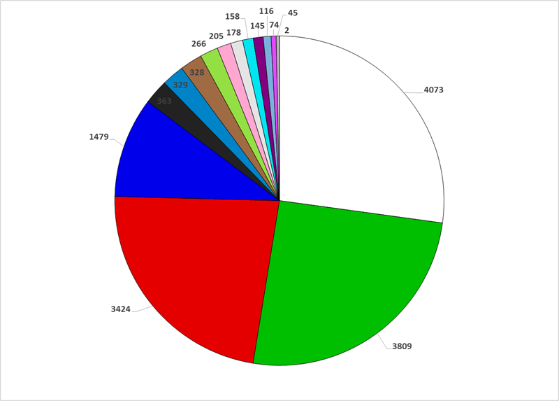
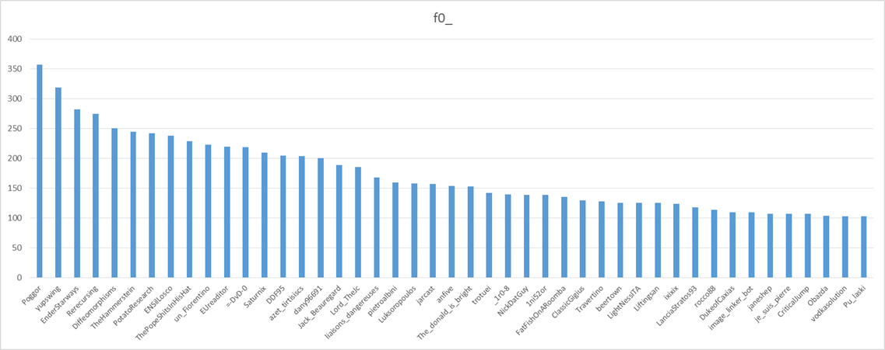

Reddit ha rilasciato il [dataset completo](https://www.reddit.com/r/redditdata/comments/6640ru/place_datasets_april_fools_2017/) di /r/place. Io ho incrociato i dati con gli utenti di Reddit italia e questo è il risultato

## I colori più usati

L'immagine parla da sé!

## Gli utenti più attivi

Ecco la top ten:

|utente|click|
|-------|-----|
|Poggor|357|
|yupswing|319|
|EnderStarways|282|
|Rerecursing|275|
|Diffeomorphisms|251|
|TheHammerstein|245|
|PotatoResearch|242|
|ENSilLosco|238|
|ThePopeShitsInHisHat|229|
|un_Fiorentino|223|
{ class="table-striped"} 

I dati completi su [sharecsv](http://www.sharecsv.com/s/04a27ec539dbcb17917258c5aecca94e/new%205.csv).

## La zona più combattuta

La parte alta sinistra della bandiera, con la vespa e il cuore UK.

## Come ho fatto

Ho considerato utenti di Reddit Italia chi abbia fatto almeno 2 commenti sui reddit italiani (alcuni) a marzo.

Potete trastullarvi anche voi, su BigQuery, io ho fatto SQL Standard (non legacy) ecco le query:

Parte comune:

    WITH users AS
      (SELECT TO_BASE64(SHA1(comments.author)) as sha, comments.author as author
       FROM `fh-bigquery.reddit_comments.2017_03` as comments
       WHERE comments.subreddit in ('italy', 'italyInformatica', 'perlediritaly', 'ItalyMotori', 'ITAGLIA')
       group by comments.author
       HAVING count(*) > 2)

Utenti:

    SELECT author, count(*)
    FROM `reddit-jg-data.place_events.all_tile_placements` as place
    LEFT JOIN users ON users.sha = place.user
    WHERE users.sha is not null
    group by author    

Coordinate: 

    SELECT x_coordinate, y_coordinate, count(*) as clicks
    FROM `reddit-jg-data.place_events.all_tile_placements` as place
    LEFT JOIN users ON users.sha = place.user
    WHERE users.sha is not null
    group by x_coordinate, y_coordinate
    having count(*) > 1

Colore:

    SELECT color, count(*) as clicks
    FROM `reddit-jg-data.place_events.all_tile_placements` as place
    LEFT JOIN users ON users.sha = place.user
    WHERE users.sha is not null
    group by color
    having count(*) > 1