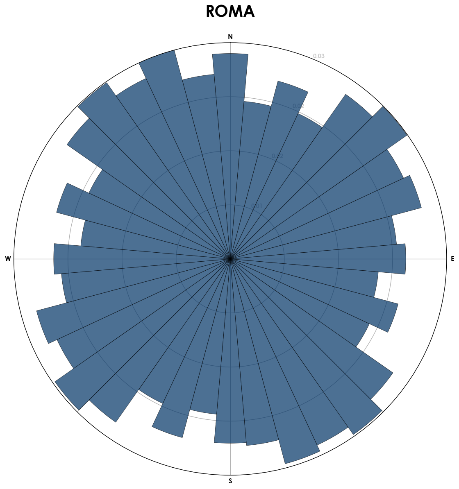
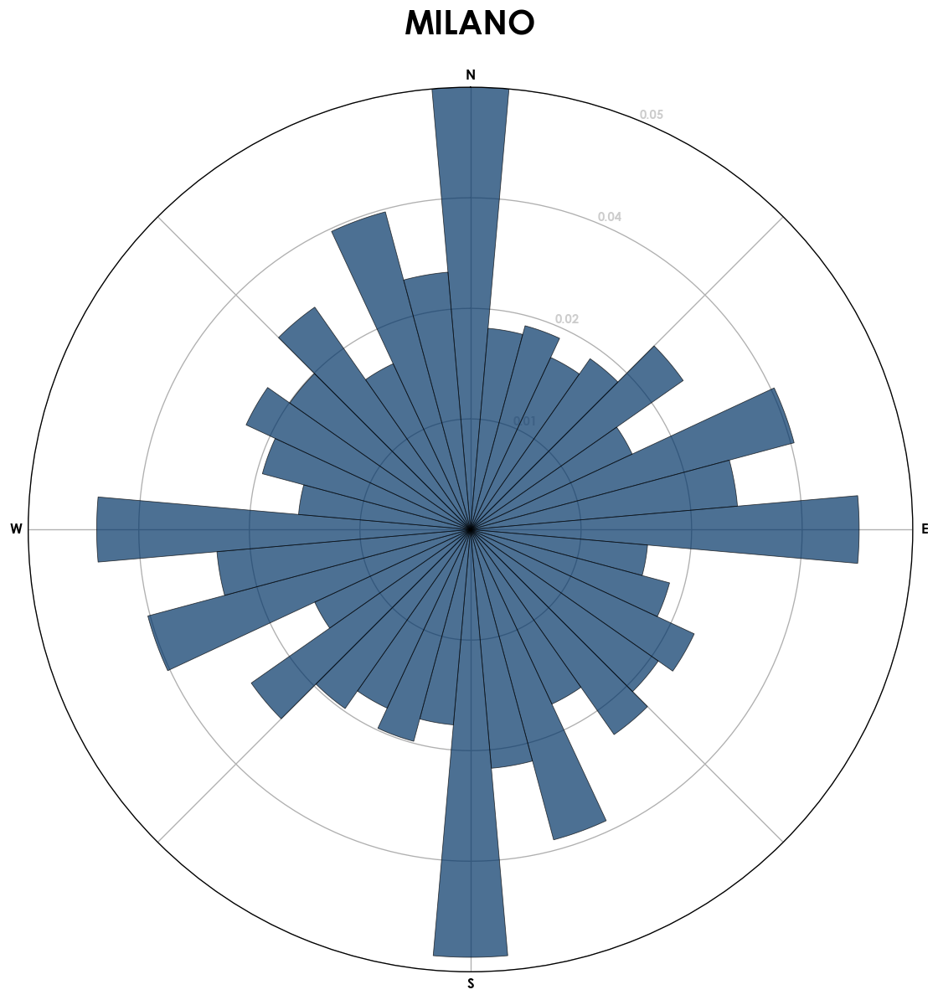
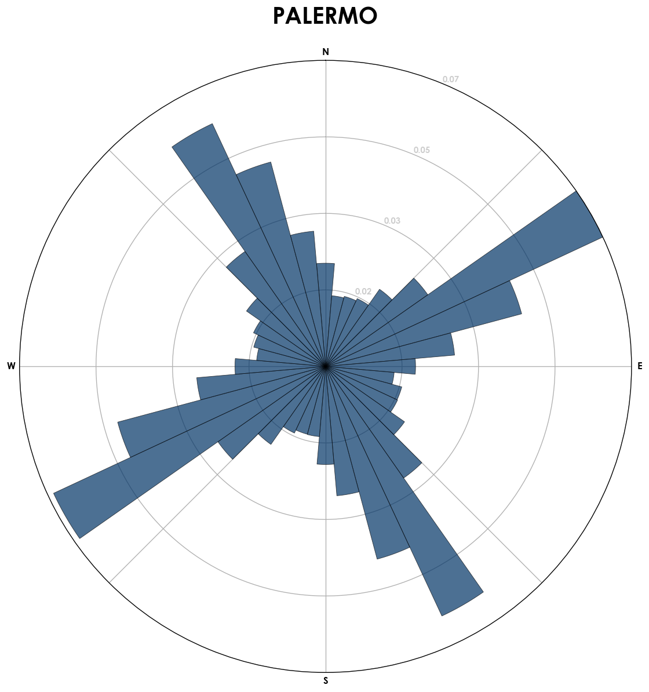
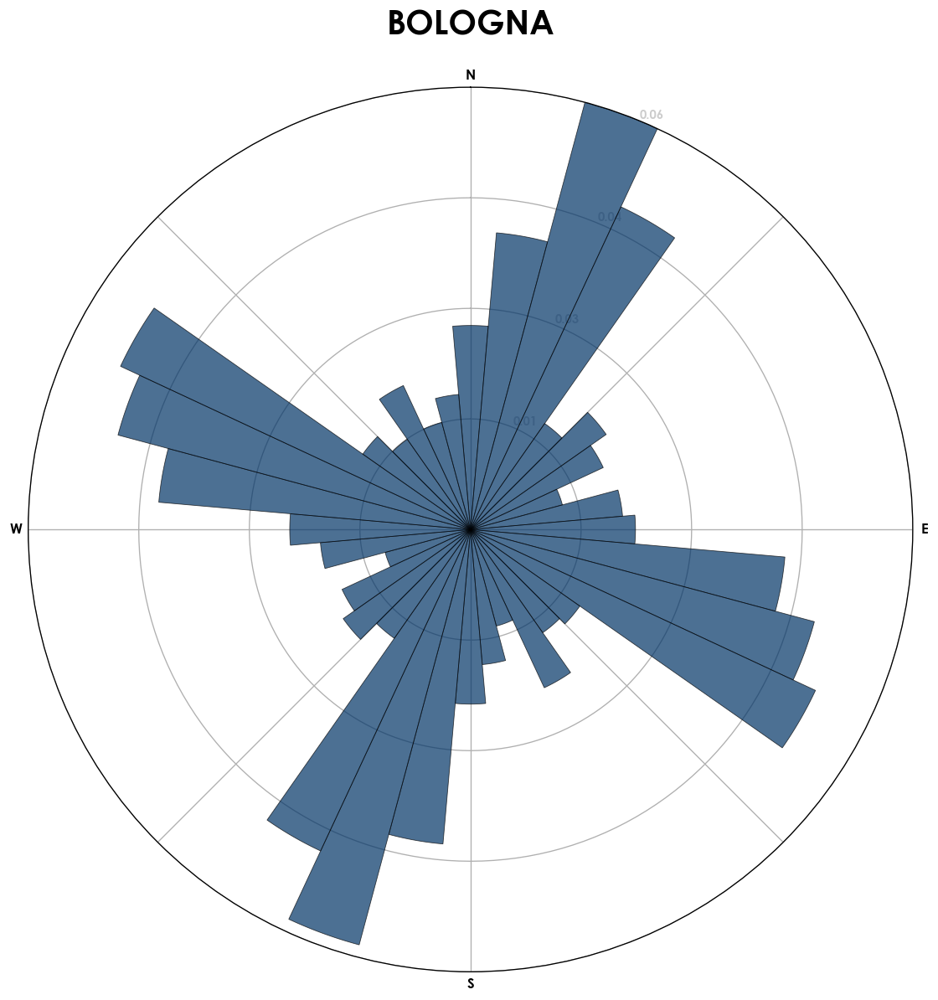

Ispirato da [questo articolo](http://geoffboeing.com/2018/07/city-street-orientations-world/) 
ho creato, grazie a
[tanto bel codice](https://github.com/gboeing/osmnx-examples/blob/master/notebooks/17-street-network-orientations.ipynb)
quasi già pronto,
dei grafici che rappresentano "come sono orientate" le città italiane.

In pratica il programma,
che trovate condiviso [su anaconda](https://notebooks.anaconda.org/timendum/street-network-orientations),
scarica da [OpenStreetMap](http://openstreetmap.org/)
le strate di una città,
poi semplifica la cartina,
fa l'elenco delle strade che rimangono
e ne calcola l'orientamento,
cioè trova qual'è la loro direzione seguendo la bussola,
quindi il tutto viene rappresentato in grafico.

Due note sui grafici:

1. non sono normalizzati tra loro,
cioè gli assi solo lunghi diversi tra grafici.
1. Sui grafici vengono rappresentate
quante strade sono orientate in un certo modo.

Ho analizzato le città con più abitanti d'Italia più alcune città interessanti.

Per i più curiosi
[su questo album](https://imgur.com/a/EBYIOIG)
trovate la cartina semplificata di ogni città analizzata.

Extra sui grafici:
ho provato ad aggiungere "peso" in base alla lunghezza della strada,
il risultato non cambia sensibilmente.

Edit: Aggiungo, a parte, [Venezia](https://imgur.com/a/s5s4fZR), però tecnicamente il comune di Venezia include anche Mestre e le zone limitrofe.  
Se passo all'isola invece, chiaramente le strade per le automobili sono pochissime, quindi devo cambiare l'estrazione dei dati per includere anche le strade pedonali etc.
