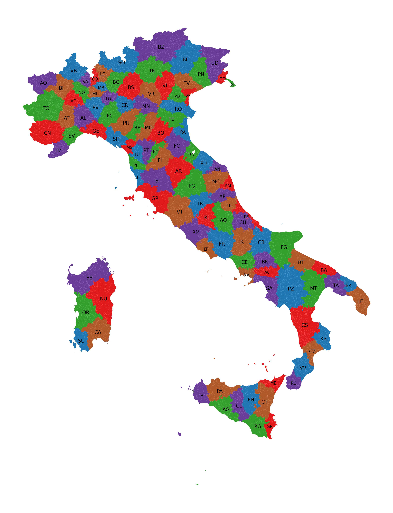
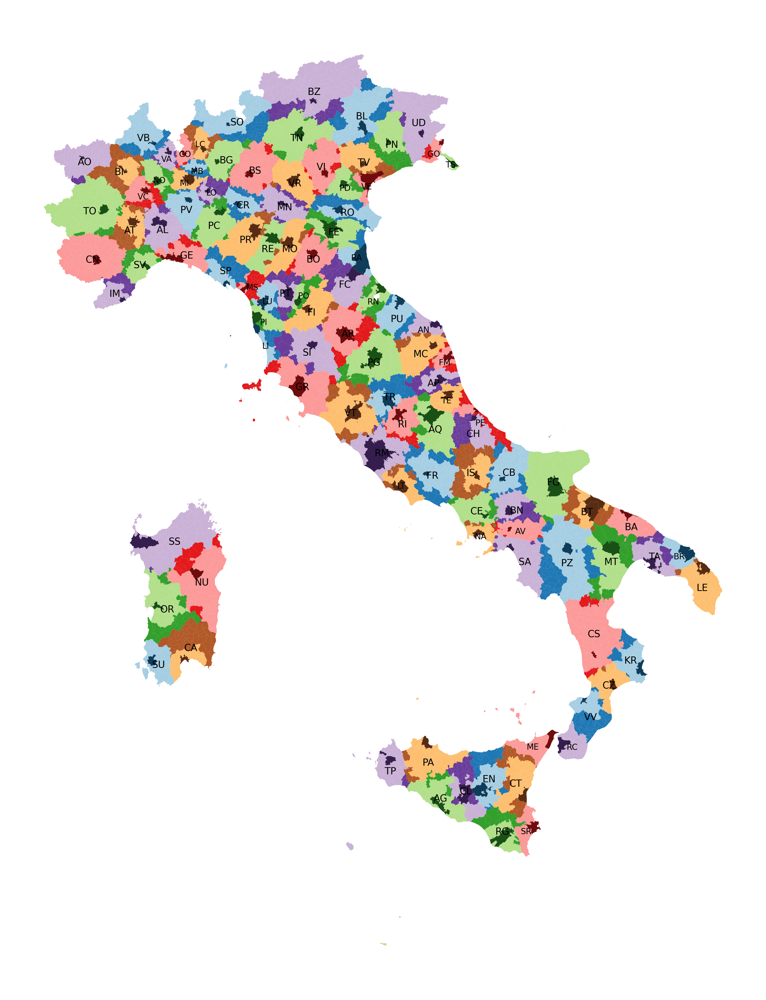

Questo è una specie di seguito del mio post di un anno fa [I capoluoghi sono al centro delle regioni?](/posts/capoluoghi-centro-regioni/), in cui mi si era fatto notare che in effetti non conta la distanza in linea d'area ma il tempo di percorrenza.

Per cui ho deciso di ridisegnare le province italiane usando come unico criterio minimizzare il tempo di percorrenza **a piedi** tra il centro di un comune e il capoluogo di provincia.

Agevolo anche una seconda mappa in cui ho messo in evidenza i comuni che hanno cambiato provincia.

È anche disponibile una grafica interattiva, per controllare comune per comune:

* [DataWrapper](https://datawrapper.dwcdn.net/Cy395/1/)
* Su [Github](https://timendum.github.io/province-vicine/)

Potrebbe metterci tanto perché deve scaricare la mappa dell’Italia più i miei dati elaborati. Giuro che non sto usando il vostro PC per minare criptovalute.

Prima che me lo diciate:

* so che le province in pratica non valgono quasi nulla, ma mi sembrava l'analisi più interessante da fare, le regioni erano troppo poche
* i dati potrebbero essere sballati, trovare un servizio per scansionare migliaia di tragitti non è facile, ho cercato di fare il meglio
* non ha nessuno scopo/senso, ma mi sono divertito a farlo
* il tempo di percorrenza \"a piedi\" è il più stabile, perché dipende linearmente dalla lunghezza del tragitto, mentre per altri mezzi dipende dal tipo di mezzo, di strada, dal traffico, ...
* (edit) il calcolo è fatto da \"centro città\" a \"centro città\", anche se il concetto non è ben definito da qualche verifica manuale mi è sembrata la cosa migliore

Risultati notabili:

* A causa della [travagliata storia delle provincie sarde](https://it.wikipedia.org/wiki/Istituzione_di_nuove_province_in_Sardegna), Cagliari è la provincia (città metropolitana che guadagna di più (guadagna più di due volte l'area l'attuale, parte da 1.248 km² e aggiunge 2.872 km²)In compenso Carbonia perde il 68%.
* La seconda provincia a guadagnare di più in percentuale è Biella, praticamente triplica) ma basta guardare [la cartina](https://commons.wikimedia.org/wiki/File:Map_of_region_of_Piedmont,_Italy,_with_provinces-it.svg) per capire come mai.
* Anche Prato è lì in torno, perché poveretta è solo una provincia piccolissima
* La seconda provincia a perdere più area in percentuale è Venezia, perché chiaramente raggiungerla a piedi non è facile.

Se interessa [ecco qui](https://pastebin.com/rjSWkcm6) il CSV diviso per provincia con la lista dei comuni aggiunti/tolti.

Per i super curiosi, il codice è interamente disponibile, insieme ad un [diario](https://github.com/timendum/province-vicine/blob/master/diario.md) che ho tenuto anche come appunti durate il progetto, dovrebbero esserci abbastanza istruzioni per rifare tutto.