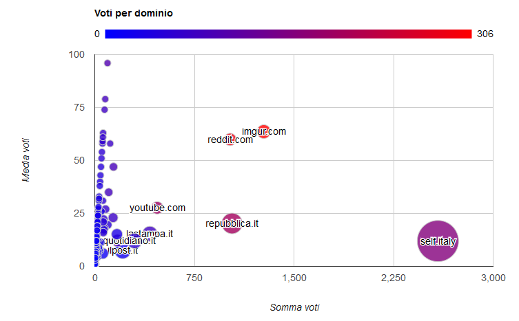
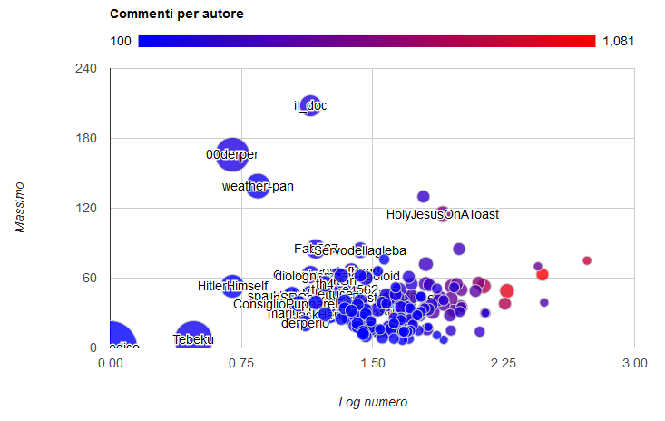

Grazie a [PRAW](https://praw.readthedocs.io/en/praw4/) ho estratto tutti i post e i commenti degli ultimi 6 mesi (esclusi gli ultimi 7 giorni).

Ho quindi avviato alcune analisi, sotto trovate il necessario per replicare.

## Migliori domini
Una volta raggruppati i domini e normalizzati i nomi, ecco un grafico rappresentativo: sulle x la somma dei voti, sulle y la media, il colore quant'è la media e la grandezza quanti ne ho trovati.

Per la versione ridotta ho mantenuto solo i maggiori domini e quelli con più di una entry.

[Grafico HTML](/subpages/ritaly-2016/domini/)

[Grafico interattivo](/subpages/ritaly-2016/domini/)

## Submission per autore
Ho raggruppato i post per autore: sulle x la somma dei voti, sulle y la media, il colore quanti ne ho trovati e la grandezza quant'è il voto minimo.

[Grafico interattivo](/subpages/ritaly-2016/autore/)

## Commenti
Ho raggruppato i post per autore: sulle x quanti commenti in scala logaritmica_2, sulle y la distanza tra il migliore ed il peggiore, il colore la media dei voti e la grandezza la somma dei voti. Il filtro è a 100 di karma in questi 6 mesi.

Per la versione ridotta ho mantenuto solo le top 10 nelle dimensioni calcolate.

[Grafico HTML](/subpages/ritaly-2016/commenti/)

[Grafico interattivo](/subpages/ritaly-2016/commenti2/)

## I commenti migliori

1. di /u/il_doc [dario fu](https://www.reddit.com/r/italy/comments/57916s/%C3%A8_morto_dario_fo/d8pz661/?context=1) con 209
1. di /u/00derper [FIGA](https://www.reddit.com/r/italy/comments/56j7ms/make_italy_great_again_miga/d8jp8jq/?context=1) con 168
1. di /u/weather-pan [Ariana grande](https://www.reddit.com/r/italy/comments/57fniv/i_am_a_bored_girl_from_hong_kong_who_happened_to/d8rlgh9/?context=1) con 142 (smentendo /u/HolyJesusOnAToast)
1. di /u/oldpoint [il riscatto](https://www.reddit.com/r/italy/comments/56r03c/til_il_reato_di_atti_osceni_%C3%A8_stato_depenalizzato/d8lnwcs/?context=1) con 128
1. di /u/El_Medico  [lo svedese](https://www.reddit.com/r/italy/comments/57m5d6/til_in_svezia_mettono_la_banana_sulla_pizza/d8tl04u?context=1) con 109 (traduzione _Most of Sweden also think it's strange_)

### Note tecniche
Grazie soprattutto a Light_fenix per il consiglio di snellimento.
 
I due CSV: https://paste.ee/p/xyFD0 e https://paste.ee/p/cMoZl

Per l'estrazione un piccolo script python che si appoggia a [PRAW](https://praw.readthedocs.io/en/praw4/).  Li ho elaborati con Excel, qualche formula per i domini più tabelle pivot.

Per i grafici ho usato [Google bubble chart](https://developers.google.com/chart/interactive/docs/gallery/bubblechart).

Per la creazione delle pagine ho usato [Thimble di Mozilla](https://thimble.mozilla.org/).

__

_edit_ ho aggiunto le versioni ridotte di dominio e commenti, grazie al suggerimento di Light_fenix e SpiegoLeDiscussioni.