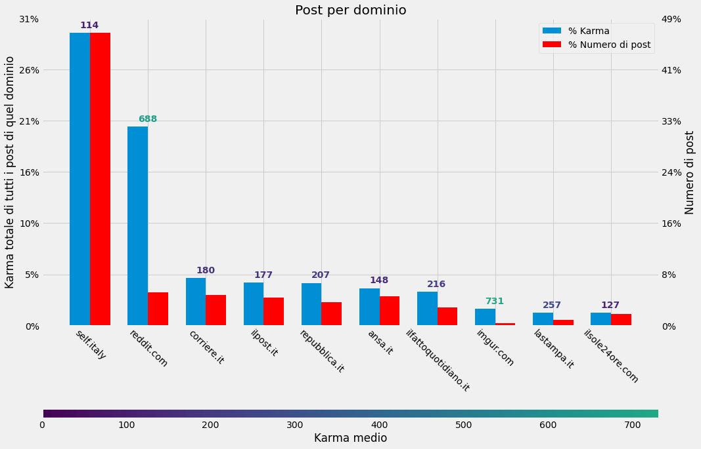

Per analizzare come è stato r/italy nel 2021 ho scaricato tutti i 6.455 post che ho trovato, salvati in csv e poi spippolati con Python. Per curiosità il primo è [questo](https://www.reddit/com/r/italy/comments/ko1de9/why_does_the_symbol_thing_for_the_president_of/) e l'ultimo è [questo](https://www.reddit/com/r/italy/comments/rt2pcd/baia_di_peter_pan_fiabilandia_rimini_ho_bisogno/).

Si tratta di 6.455 post, di cui 3.008 (il 46%) post di testo (self) e il rimanente link, crosspost o altro.Solo 29 sono segnati come NSFW. Reddit riporta un totale di 1.254.494 (più di un milione) di commenti in questi post.

Il post medio riceve un punteggio di 187 e 194 commenti.

## I top

### I post più votati

Ecco i 5 post più votati del 2021:

|Punteggio|Post|Autore|
|:-|:-|:-|
|45.769|[Abbiamo vinto, mandiamo la nostra bandiera sulla frontpage!!](https://www.reddit.com/r/italy/comments/oidg8i/abbiamo_vinto_mandiamo_la_nostra_bandiera_sulla/)|u/regian24|
|3.670|[Based on a fellow redditor’s photo from yesterday. ‘Etna is erupting’ 7x5” gouache.](https://www.reddit.com/r/italy/comments/lmo50s/based_on_a_fellow_redditors_photo_from_yesterday/)|u/bunkerbash|
|3.327|[This Illustration, by a peruvian artist,of Italy as a Mario Level with landmarks is indredible](https://www.reddit.com/r/italy/comments/nlbd10/this_illustration_by_a_peruvian_artistof_italy_as/)|u/pakito6969|
|3.273|[Alcune cose non cambiano mai - Mancini e Vialli (2021 e 1986)](https://www.reddit.com/r/italy/comments/o8s5jr/alcune_cose_non_cambiano_mai_mancini_e_vialli/)|u/PonkiPonkiPoo|
|2.988|[Ancient Romans compared to present-day Italians](https://www.reddit.com/r/italy/comments/n8c75p/ancient_romans_compared_to_presentday_italians/)|u/_civilised|

### I post più commentati

Ecco i post con più commenti:

|Numero di commenti|Post|Autore|
|:-|:-|:-|
|7.755|[\[Megathread\] Eurovision Song Contest 2021 - Serata Finale](https://www.reddit.com/r/italy/comments/nio96i/megathread_eurovision_song_contest_2021_serata/)|u/Lord_TheJc|
|5.438|[\[Megathread\] 71° Festival di Sanremo - Prima Serata](https://www.reddit.com/r/italy/comments/lwa6o8/megathread_71_festival_di_sanremo_prima_serata/)|u/Jockbaia|
|5.354|[\[Megathread\] 71° Festival di Sanremo - Terza Serata (Cover/Duetti)](https://www.reddit.com/r/italy/comments/lxsr5d/megathread_71_festival_di_sanremo_terza_serata/)|u/Jockbaia|
|4.919|[\[MEGATHREAD\] Finale EURO 2020 Italia - Inghilterra](https://www.reddit.com/r/italy/comments/oi9q73/megathread_finale_euro_2020_italia_inghilterra/)|u/nerdvana89|
|3.336|[\[Megathread\] Semifinale EURO 2020 - Italia - Spagna](https://www.reddit.com/r/italy/comments/of0rat/megathread_semifinale_euro_2020_italia_spagna/)|u/nerdvana89|
|3.157|[\[Megathread\] 71° Festival di Sanremo - Seconda Serata](https://www.reddit.com/r/italy/comments/lx1w6u/megathread_71_festival_di_sanremo_seconda_serata/)|u/Jockbaia|
|3.003|[Megathread Coronavirus \* 19/07/21 - 25/07/21](https://www.reddit.com/r/italy/comments/on2zs0/megathread_coronavirus_190721_250721/)|u/Lyrtil|
|2.899|[Megathread Coronavirus \* 08/03/21 - 14/03/21](https://www.reddit.com/r/italy/comments/m04o44/megathread_coronavirus_080321_140321/)|u/Lyrtil|
|2.566|[Megathread Coronavirus \* 19/04/21 - 25/04/21](https://www.reddit.com/r/italy/comments/mtqhlv/megathread_coronavirus_190421_250421/)|u/Lyrtil|
|2.359|[Caffè Italia \* 04/10/21](https://www.reddit.com/r/italy/comments/q0wxma/caffè_italia_041021/)|u/RedditItalyBot|

Escludendo Caffè, megathread e simili, troviamo:

|Numero di commenti|Post|Autore|
|:-|:-|:-|
|1.999|[Il thread delle opinioni impopolari](https://www.reddit.com/r/italy/comments/o2wrvu/il_thread_delle_opinioni_impopolari/)|u/nan|
|1.852|[DRAGHI 🀄](https://www.reddit.com/r/italy/comments/lb5mkt/draghi/)|u/MyPendrive|
|1.515|[AskRagazze: tutto quello che avreste voluto sapere sulle donne (ma non avete mai osato chiedere)](https://www.reddit.com/r/italy/comments/kzqz77/askragazze_tutto_quello_che_avreste_voluto_sapere/)|u/nan|
|1.490|[Opinioni impopolari sulla musica italiana](https://www.reddit.com/r/italy/comments/pkxk5q/opinioni_impopolari_sulla_musica_italiana/)|u/Ancient_Badger5777|
|1.419|[No stupid questions r/Italy edition](https://www.reddit.com/r/italy/comments/nuy380/no_stupid_questions_ritaly_edition/)|u/nerdvana89|
|1.270|[Parole / espressioni comuni che odiate sentire senza un motivo preciso](https://www.reddit.com/r/italy/comments/pkbf3q/parole_espressioni_comuni_che_odiate_sentire/)|u/nan|

### I post più premiati

Ecco i post che invece hanno ricevuto più premi (compresi quelli gratuiti):

|Numero di premi|Numero di Gold|Post|Autore|
|:-|:-|:-|:-|
|589|2|[Abbiamo vinto, mandiamo la nostra bandiera sulla frontpage!!](https://www.reddit.com/r/italy/comments/oidg8i/abbiamo_vinto_mandiamo_la_nostra_bandiera_sulla/)|u/regian24|
|107|1|[BEST BRAU MASTERRACE: la recensione di tutte (o quasi ) le birre dell'eurospin](https://www.reddit.com/r/italy/comments/m67cu8/best_brau_masterrace_la_recensione_di_tutte_o/)|u/shepard281|
|95|1|[Ho abortito e non me ne pento.](https://www.reddit.com/r/italy/comments/psmrw0/ho_abortito_e_non_me_ne_pento/)|u/neroina|
|77|1|[\[FantaCalcio\] Statistiche Asta 2021](https://www.reddit.com/r/italy/comments/p81a4m/fantacalcio_statistiche_asta_2021/)|u/hamlet84|
|74|1|[Dopo 13 anni come sviluppatori software io e il mio collega ci siamo dimessi e abbiamo investito tutto nel fondare un'azienda di videogiochi. Ieri abbiamo rilasciato Medievalien, un gioco in cui degli Alieni arrivano in un mondo fantasy Medievale. Chiedeteci pure qualunque cosa!](https://www.reddit.com/r/italy/comments/lihaaa/dopo_13_anni_come_sviluppatori_software_io_e_il/)|u/b4gn0|

### Gli autori più attivi

In un grafico i 10 utenti che postano di più su r/italy.

Da soli fanno il 10% dei post e il 9% del karma.

### I post perfetti

Per ogni post, Reddit riporta anche la percentuale di voti positivi (upvote) rispetto ai negativi (downvote), ci sono alcuni post con (immagino approssimativamente) 100% di upvote, eccoli:

|Punteggio|Post|Autore|
|:-|:-|:-|
|1702|[La prima volta che vedo un negozio Panini, non sapevo esistessero (trovato in Cile)](https://www.reddit.com/r/italy/comments/o3n8g0/la_prima_volta_che_vedo_un_negozio_panini_non/)|u/nicosecci|
|956|[Giarre after tonight Etna eruption](https://www.reddit.com/r/italy/comments/lzsdux/giarre_after_tonight_etna_eruption/)|u/Pietro1203|
|713|[Due foto del celebre duello di spada tra Ungaretti e Bontempelli](https://www.reddit.com/r/italy/comments/kwrqr3/due_foto_del_celebre_duello_di_spada_tra/)|u/ViVilma|
|708|[Corrado Augias si lamenta su "la Repubblica" di un'incomprensibile comunicazione da parte di Enel, senza rendersi conto di essere incappato in un tentativo di phishing](https://www.reddit.com/r/italy/comments/l8lgxt/corrado_augias_si_lamenta_su_la_repubblica_di/)|u/mirazef|
|607|[Canone Rai, l’Unione Europea: rimuoverlo dalla bolletta elettrica entro il 2022](https://www.reddit.com/r/italy/comments/qrtanl/canone_rai_lunione_europea_rimuoverlo_dalla/)|u/Massimo24ore|
|594|[Tour de France, ricercata in tutto il Paese la spettatrice che ha esposto un cartello e provocato la caduta di 150 ciclisti](https://www.reddit.com/r/italy/comments/oa9bdv/tour_de_france_ricercata_in_tutto_il_paese_la/)|u/16F628A|
|248|[Il Monte Etna ha incrementato la sua altezza raggiungendo i 3357 metri. Questo grazie ai circa 50 episodi parossistici che da febbraio 2021 hanno interessato il Cratere di Sud-Est del vulcano](https://www.reddit.com/r/italy/comments/p28xdc/il_monte_etna_ha_incrementato_la_sua_altezza/)|u/giuliomagnifico|
|245|[Reggio Calabria, la cupola dei vigili urbani: furti di merce agli ambulanti, ricatti e auto cannibalizzate.](https://www.reddit.com/r/italy/comments/oo6fh6/reggio_calabria_la_cupola_dei_vigili_urbani_furti/)|u/ShoppingOk2838|
|243|[Nicola è salvo: il bambino scomparso sul Mugello ritrovato vivo dopo due notte di ricerche](https://www.reddit.com/r/italy/comments/o68ela/nicola_è_salvo_il_bambino_scomparso_sul_mugello/)|u/n0_1d|
|224|[Pulcinella di mare a Taranto, avvistamento straordinario nella città dell'Ilva: "Non succedeva da fine Ottocento"](https://www.reddit.com/r/italy/comments/nv7y2v/pulcinella_di_mare_a_taranto_avvistamento/)|u/Nepente|
|213|[È stato arrestato l'ex bandito Graziano Mesina, latitante dal 2020](https://www.reddit.com/r/italy/comments/rj3cao/è_stato_arrestato_lex_bandito_graziano_mesina/)|u/MicheleCaracas|
|176|[Tre fermi per la strage del Mottarone](https://www.reddit.com/r/italy/comments/nl92yp/tre_fermi_per_la_strage_del_mottarone/)|u/Gillauino|
|121|[U-Mask, il ministero della Salute impone lo stop alla vendita: "Non sono dispositivo medico, potenziali rischi per la salute"](https://www.reddit.com/r/italy/comments/lnqs3m/umask_il_ministero_della_salute_impone_lo_stop/)|u/Fec31|

## Una "foto" di tutti i post

Ecco un grafico con tutti i post del 2021, esclusi Caffè, Megathread (San Remo, Eurovision, etc inclusi).

## I grafici cumulativi

### I post suddivisi per punteggio

Sperando in una rappresentazione più chiara, ho rappresentato sul grafico successivo quanti post (sulle y, in scala logaritmica) hanno terminato con quel punteggio (sulle x).

### I post suddivisi per numero di commenti

Come prima, ma contando il numero di commenti finale.

## Approfondimenti

### Analisi per ora di invio

Ho poi rappresentato su un grafico quanti post (sulle y) vengono inviati in ogni ora del giorno. (Escluso il [top post](https://www.reddit.com/r/italy/comments/oidg8i/abbiamo_vinto_mandiamo_la_nostra_bandiera_sulla/)). Il colore del pallino rappresenta il punteggio medio dei post in quell'ora. Ne deduciamo quindi che i post inviati tra le 7 e le 10 del mattino sono leggermente meglio votati.

### Analisi per giorno di invio

Come sopra, ma suddivisi per giorno al posto che per ora.

### La destinazione dei post

Sul grafico successivo trovate i post suddivisi per dominio, cioè su che sito ti porta il link (se presente), in percentuale sul totale.Il numero sopra la barra corrisponde al punteggio medio del post di quella categoria.

Ad esempio abbiamo avuto 285 post verso ilpost.it (il 4.4% dei post), per un totale di 50.515 karma (il 4.3% del karma totale), con una media di 177 karma per post.

Considerazione personale: i self sono quelli più presenti ma anche più vari, ce ne sono di tutti i tipi e con risultati diversi. Immagini (reddit.com e imgur) non sono così presenti ma sono molto votati, il triplo degli altri (perché sono un contenuto facile?); ilpost NON è la fonte principale, né per numero di post né per voti (totali o medi).

## Andamento nell'anno

### Numero di commenti

Ho voluto rappresentare mediamente quanti commenti hanno ricevuto i post (esclusi caffè, megathread, ...) nel corso dell'anno. In arancione una regressione polinomiale di 2o grado, cioè una curva che dovrebbe rappresentare il macro-andamento nell'anno.

### Punteggio

Come sopra, ma con il punteggio finale dei post.Qui la regressione è di 8o grado perché il trend è molto più ondulatorio, con un enorme picco a luglio/agosto.

## Come ho fatto?

Ho scaricato i dati aggiornati dei post con PRAW, salvati in un csv, quindi analizzati in Python, su un notebook Jupyter, grazie a pandas, numpy, scipy; i grafici sono fatti con matplotlib.

Il codice è [su gist](https://gist.github.com/timendum/f682ed84c1dca8b48cab9542c832daa0).

Un grazie a u/dhc21 per la revisione dei contenuti.