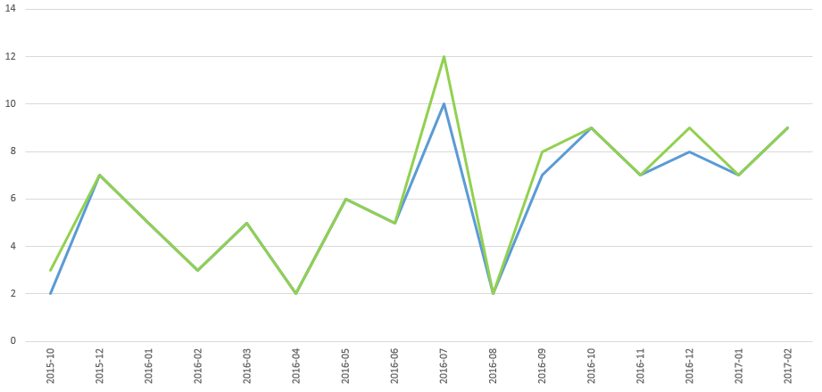

Come chiesto da LaTalpa123, ecco una personale analisi dei contenuti di /r/italy che hanno ricevuto il gold.

## Perimetro
L'analisi include 99 post, dal [18/09/2015](https://np.reddit.com/r/italy/comments/3lecya/ieri_sera_ho_mangiato_allosteria_francescana_di/) a oggi (ieri in realtà l'[ultimo](https://np.reddit.com/r/italy/comments/5ziuim/come_immaginate_fisicamente_gli_utenti_di_ritaly/) registrato).

## Grafici

### Gold su tempo

_Blu = conteggio contenuti con gold_  
_Verde = somma dei valore_

Ho eliminato ultimo e primo mese, in quanto potenzialmente incompleti.

**Commento personale**: ad agosto tutti in ferie

### Gold per voto

_Blu = submission_  
_Verde = commenti_

**NOTA**: ho dovuto eliminare [questo](https://np.reddit.com/r/italy/comments/5gaxee/me_irl/) perchè troppo fuori scala (2177 contro <500 del secondo)

## Tabelle dei notabili

### Quanto gold

Per tipo:

Tipologia | quantità totale | numero volte | media | 
---|---|----|----|
Commento | 31 | 27 | 1,148148148 | 
Link | 73 | 72 | 1,013888889 | 
{ class="table-striped"} 

Quindi i commenti pagano poco di più ma capita molto meno spesso (meno della metà)

### Chi ha ricevuto più Gold

utente | quantità totale | numero di volte |
-------|---------|-------|
/u/LaTalpa123 | 5 | 5 | 
/u/ElSelby | 4 | 3 | 
/u/BoxMulder | 3 | 1 | 
/u/LanciaStratos93 | 3 | 3 | 
/u/vehement_nihilist | 3 | 3 | 
/u/kastardenna18 | 2 | 1 | 
/u/Micolash90 | 2 | 1 | 
/u/badgirlgoneworse | 2 | 2 | 
/u/giganterossa | 2 | 2 | 
/u/macedogna | 2 | 2 | 
/u/matart91 | 2 | 2 | 
/u/sempiternum | 2 | 2 | 
/u/ZugNachPankow | 2 | 2 | 
{ class="table-striped"} 

### Casi estremi

Il punteggio peggiore, tra tutti i gold è di [Signor_Rana](https://np.reddit.com/comments/5c29lc//d9t667j).

L'unico altro negativo è di [LanciaStratos93](https://np.reddit.com/comments/4vgfwk//d5yey8n), ma solo -1.

(non ci sono stati gold a submission non positive [il minimo dei post è 0]).

Il migliore è del periodo [panettone/pandoro](https://np.reddit.com/r/italy/comments/5gaxee/me_irl/).

Il miglior link successivo si assesta a [355](https://np.reddit.com/comments/3o7bh8//cvuoi0n)

Il contenuto con più gold è di [suspance di BoxMulder](https://np.reddit.com/r/italy/comments/4u3y8v/suspense_oc/)

## Tecnicismi

Ho usato PRAW per estrarre i gold di italy.

Excel per elaborare i dati.

Trovate i dati dell'estrazione su [sharecsv](http://www.sharecsv.com/s/ef327b8d8d279fe3c591ec730bbc5947/gold.csv).