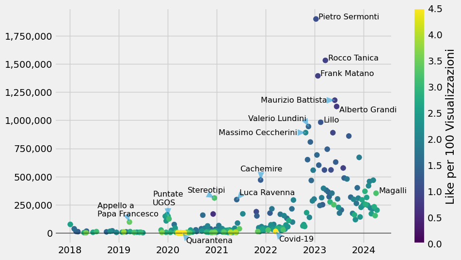
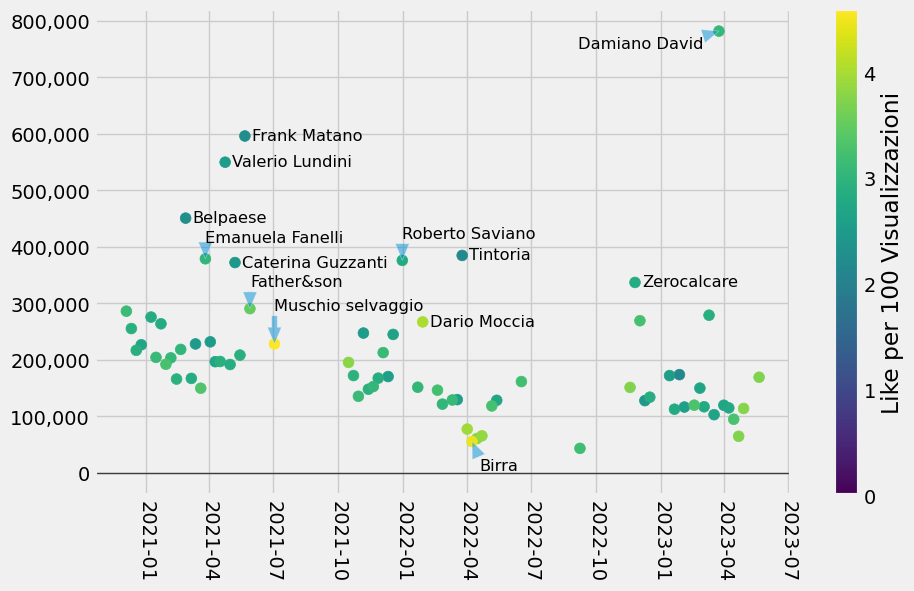

Mi hanno consigliato e ho visto più volte citato sia Tintoria che Cachemire
qui su r/italy e ho provato ad avvicinarmi,
ma soprattutto Tintoria,
che ha più di 200 puntate lunghe quasi sempre più di un'ora,
mi è sembrato grosso da approcciare.

Quindi ho scaricato da Youtube alcune statistiche delle puntate e le ho rappresentate su un grafico.

## Tintoria

Ogni pallino rappresenta una puntata, cioè un video su Youtube:
più è a destra più è recente,
più è in alto più visualizzazioni vengono riportate,
più è giallo e più Like ha in rapporto con le visualizzazioni
(giallo vuol dire più di 4 like ogni 100 visualizzazioni).

Si nota un boom incredibile a fine 2023,
mi sembra a seguito dell'entrata del podcast nel circuito OnePodcast (di Radio Deejay);
altre motivazioni non ne ho trovate.

Ho trovato fuori norma e quindi evidenzio:

- [Appello a Papa Francesco](https://www.youtube.com/watch?v=AP260FbhNDk),
    che ha visualizzazioni dieci volte tanto rispetto gli altri video dello stesso periodo.
- Discorso simile per le "Puntante UGOS"
    [1](https://www.youtube.com/watch?v=meQLFglZLoE),
    [2](https://www.youtube.com/watch?v=_w6xuUVniu4),
    [3](https://www.youtube.com/watch?v=meQLFglZLoE),
    [4](https://www.youtube.com/watch?v=MLNoSsqIBhY),
    [5](https://www.youtube.com/watch?v=youkHSQ-qEU).
- Un rating incredibilmente alto per le puntante "In tempo di quarantena",
    quasi tutte sopra i 4 Like per ogni 100 Views (ma hanno meno di 1,000 views tipicamente).
- [Stereotipi sugli ITALIANI](https://www.youtube.com/watch?v=wwZiaf03jd4), che oltre alle Views ha anche un buon rapporto Like/Views
- [Luca Ravenna](https://youtube.com/watch?v=BJkFC-Efzcw) è la seconda a superare le 250,000 visualizzazioni
- [vs Cachemire Podcast](https://www.youtube.com/watch?v=PKYcoBmoYq4) è una puntata da record, la prima sopra le 450,000
- Altro record di like per [Covid-19](https://www.youtube.com/watch?v=vpLKZ4RRtYc), 46 Like ogni 1000 Views, e siamo oltre le 10.000 visualizzazioni
- Poi ci sono tutte quelle TOP, in ordine:
  - [Pietro Sermonti](https://www.youtube.com/watch?v=L1Uuv0Gr2k8)
  - [Rocco Tanica](https://www.youtube.com/watch?v=4Slailmgku4)
  - [Frank Matano](https://www.youtube.com/watch?v=LjL1LuT7nRg)
  - [Maurizio Battista](https://www.youtube.com/watch?v=jMk1o9wYTNo)
  - [Alberto Grandi](https://www.youtube.com/watch?v=3z2cS1h_pYU)
  - [Lillo](https://www.youtube.com/watch?v=UvVMjXGhpaQa)
  - [Valerio Lundini](https://www.youtube.com/watch?v=TYH6NrXXlEM&themeRefresh=1)
  - [Massimo Ceccherini](https://www.youtube.com/watch?v=1pBszVt2PRw)
- Infine segnalo [Giancarlo Magalli](https://www.youtube.com/watch?v=3-Fmp4xvBxc), che ha molte views e un buon rapporto Like/Views

## Cachemire

Stessa cosa anche per Cachemire Podcast, anche se ha molte meno puntante.

Qui come si vede le puntate sono quasi tutte in una fascia ben definita, tra le 300,000 e le 100,000 visualizzazioni.

Segnalo le più viste:

- [Damiano David](https://www.youtube.com/watch?v=x8uyDNJGzFg), la puntata più vista
- [Frank Matano](https://www.youtube.com/watch?v=J6wbsKlOUoo), ospite molto visto anche su questo podcast
- [Valerio Lundini](https://www.youtube.com/watch?v=prouISP730Y), seconda costante
- [Tutto il Belpaese regione per regione](https://www.youtube.com/watch?v=7HckjtgN03g), la puntata più vista senza ospite
- [La puntata crossover](https://www.youtube.com/watch?v=3HITTjqC69M), con Rapone e Tinti
- [Emanuela Fanelli](https://www.youtube.com/watch?v=iOYdND7HlGE)
- [Roberto Saviano](https://www.youtube.com/watch?v=_z8yI0JfjK0)
- [Caterina Guzzanti](https://www.youtube.com/watch?v=vPAQH8me14Q)
- [Zerocalcare](https://www.youtube.com/watch?v=twBOBISCgXw)
- [Father&son](https://www.youtube.com/watch?v=SxyTlVHxBrc), la puntata con i genitori di Ferrario e Ravenna

Inoltre, eccezionali per il rapporto Like/Views:

- [Dario Moccia](https://www.youtube.com/watch?v=ZOP991ANGd4)
- [Il Tempo di Una Birra parte 2](https://www.youtube.com/watch?v=QmQp-3XtVJg)
- la puntata con [Muschio selvaggio](https://www.youtube.com/watch?v=zjixqVs0UUY)

## Come ho fatto?

Per i più curiosi, trovate i dati analizzati e il codice usato per l'analisi su questo [gist](https://gist.github.com/timendum/7a18176246d4c7466043484691c81359).
